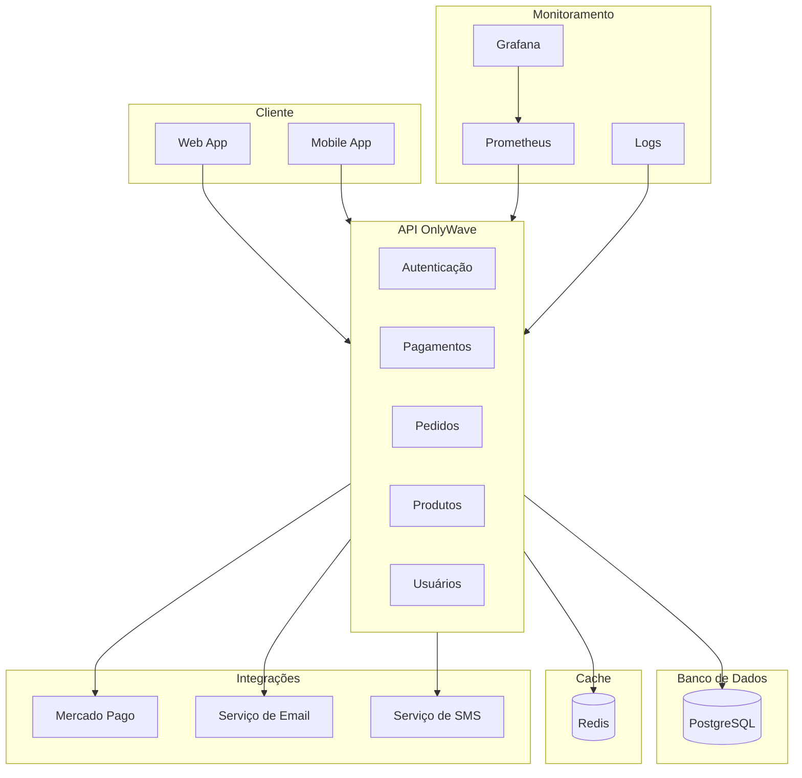
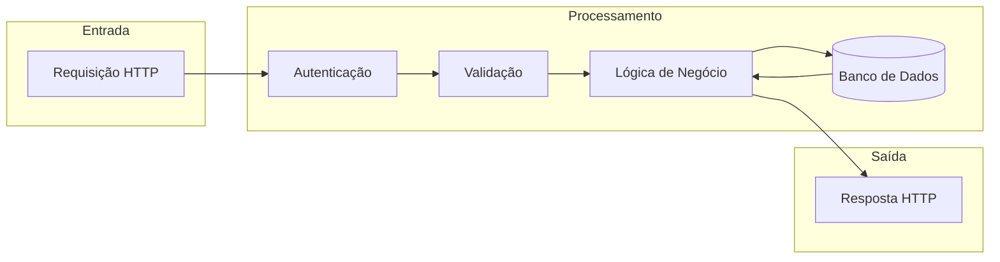

# Arquitetura do Sistema OnlyWave

Este diagrama ilustra a arquitetura geral do sistema OnlyWave, incluindo os componentes principais e suas interações.

## Componentes Principais

### API OnlyWave
- **Autenticação**: Gerencia autenticação e autorização de usuários
- **Pagamentos**: Integração com Mercado Pago e processamento de pagamentos
- **Pedidos**: Gerenciamento de pedidos e status
- **Produtos**: Catálogo de produtos e estoque
- **Usuários**: Gerenciamento de usuários e perfis

### Banco de Dados
- **PostgreSQL**: Armazena dados transacionais e relacionais
- **Redis**: Cache e armazenamento de sessões

### Integrações
- **Mercado Pago**: Processamento de pagamentos
- **Serviço de Email**: Notificações por email
- **Serviço de SMS**: Notificações por SMS

### Monitoramento
- **Prometheus**: Coleta de métricas
- **Grafana**: Visualização de métricas e dashboards
- **Logs**: Registro de eventos e erros

## Fluxo de Dados

