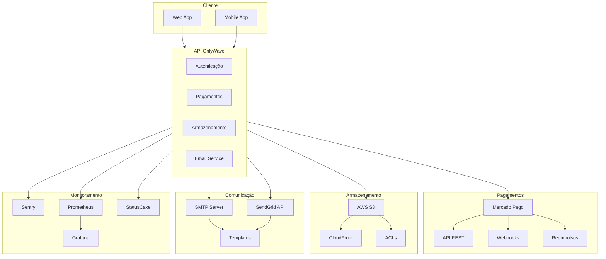
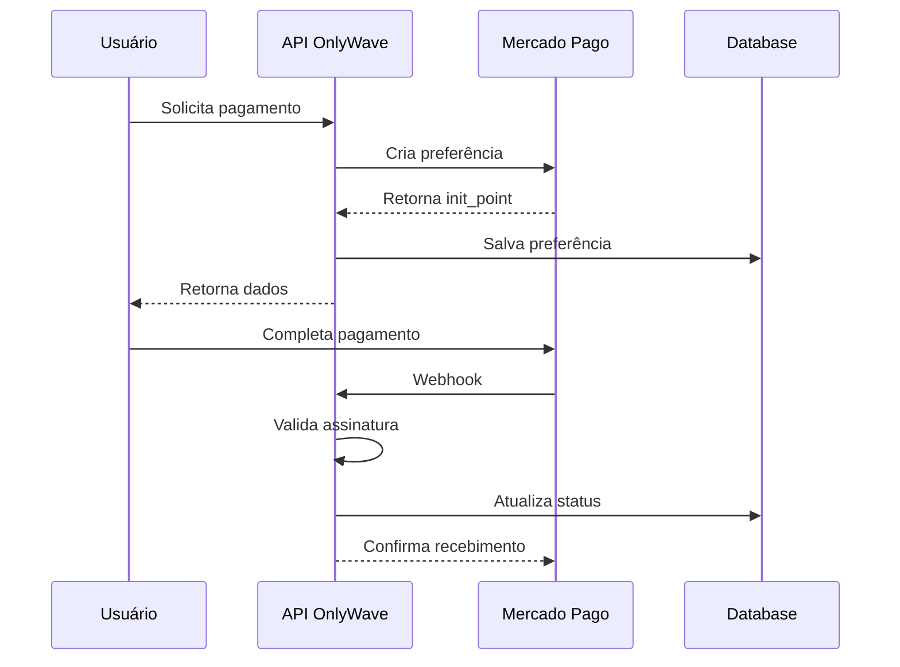
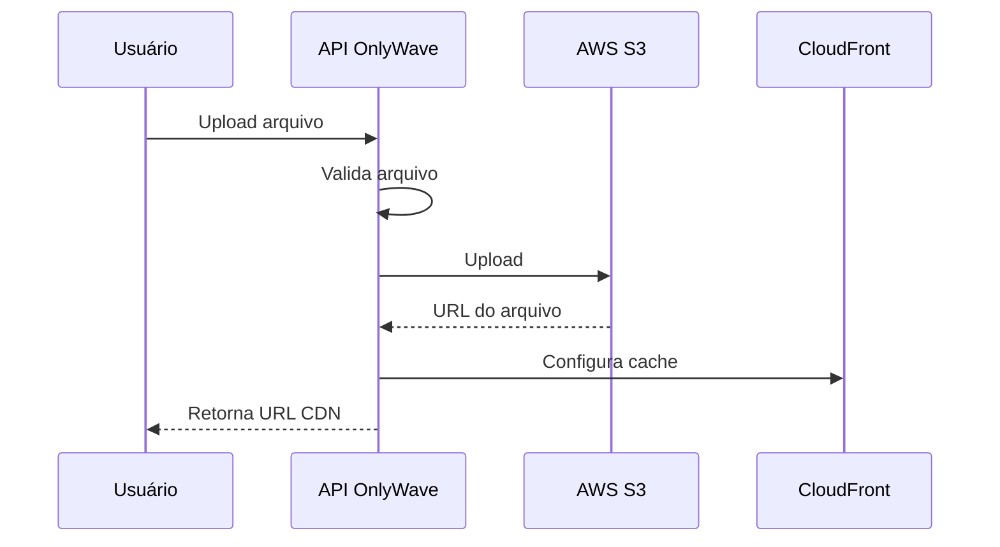
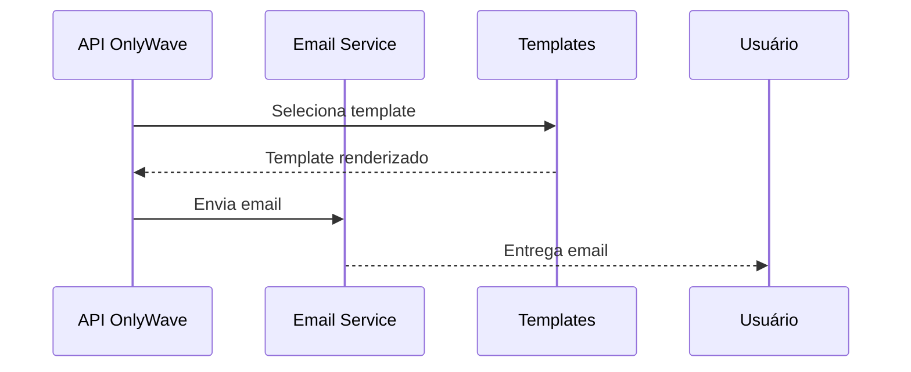

# Integrações Externas do OnlyWave

Este diagrama ilustra todas as integrações externas do sistema OnlyWave, incluindo serviços de pagamento, armazenamento, comunicação e monitoramento.

## Visão Geral das Integrações

## Fluxo de Integração com Mercado Pago

## Fluxo de Armazenamento com S3

## Fluxo de Email

## Componentes das Integrações

### Mercado Pago
- **API REST**: Endpoints para pagamentos
- **Webhooks**: Notificações de status
- **Reembolsos**: Processamento de reembolsos
- **Autenticação**: Bearer Token

### AWS S3
- **Upload**: Armazenamento de arquivos
- **CDN**: Distribuição de conteúdo
- **ACLs**: Controle de acesso
- **URLs Assinadas**: Acesso temporário

### Email Service
- **SMTP**: Servidor de email
- **SendGrid**: API de email
- **Templates**: Templates de email
- **Tracking**: Rastreamento de envios

### Monitoramento
- **Sentry**: Captura de erros
- **Prometheus**: Métricas
- **Grafana**: Dashboards
- **StatusCake**: Healthchecks 