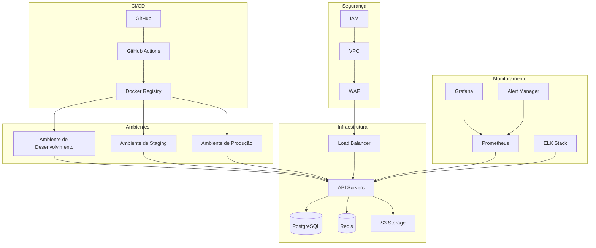
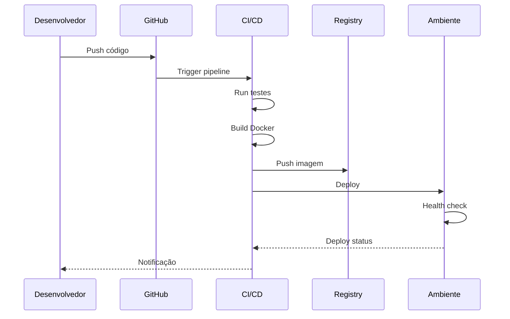
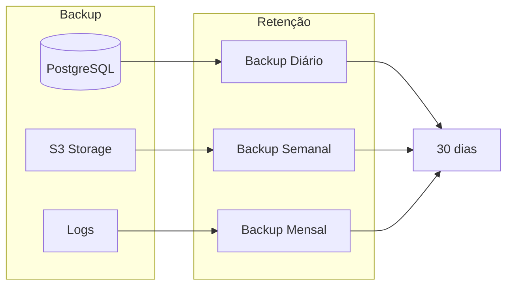

# Infraestrutura do Sistema OnlyWave

Este diagrama ilustra a infraestrutura completa do sistema OnlyWave, incluindo ambientes, serviços e fluxos de deploy.

## Componentes da Infraestrutura

### Ambientes
- **Desenvolvimento**: Ambiente local para desenvolvimento e testes
- **Staging**: Ambiente de homologação para testes de integração
- **Produção**: Ambiente de produção com alta disponibilidade

### CI/CD
- **GitHub**: Repositório de código
- **GitHub Actions**: Pipeline de CI/CD
- **Docker Registry**: Registro de imagens Docker

### Infraestrutura Core
- **Load Balancer**: Distribuição de carga
- **API Servers**: Servidores da aplicação
- **PostgreSQL**: Banco de dados principal
- **Redis**: Cache e sessões
- **S3**: Armazenamento de arquivos

### Monitoramento
- **Prometheus**: Coleta de métricas
- **Grafana**: Dashboards e visualização
- **ELK Stack**: Análise de logs
- **Alert Manager**: Gestão de alertas

### Segurança
- **WAF**: Web Application Firewall
- **VPC**: Rede privada virtual
- **IAM**: Gestão de identidade e acesso

## Fluxo de Deploy

## Estratégia de Backup

