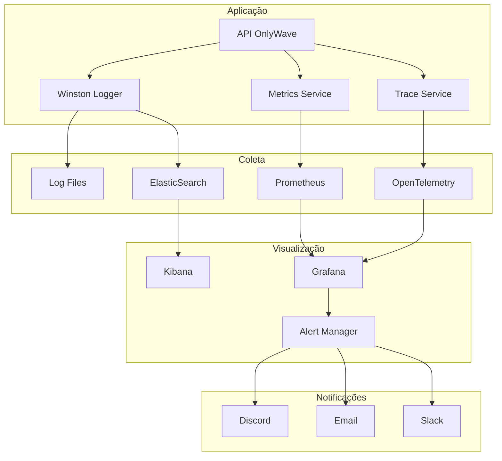
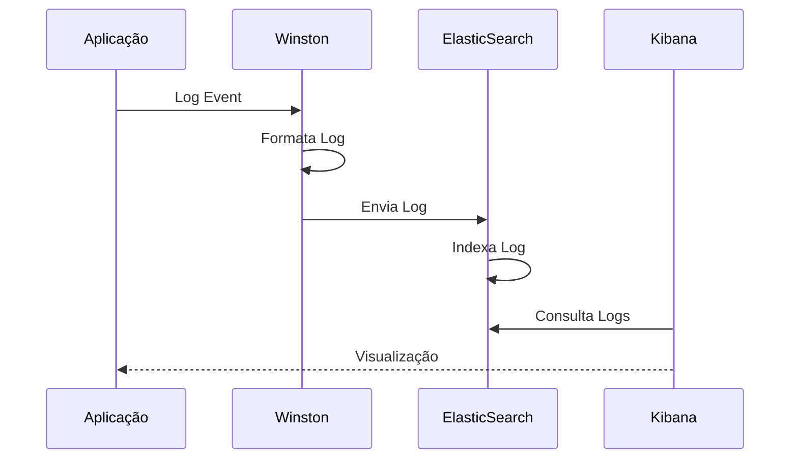
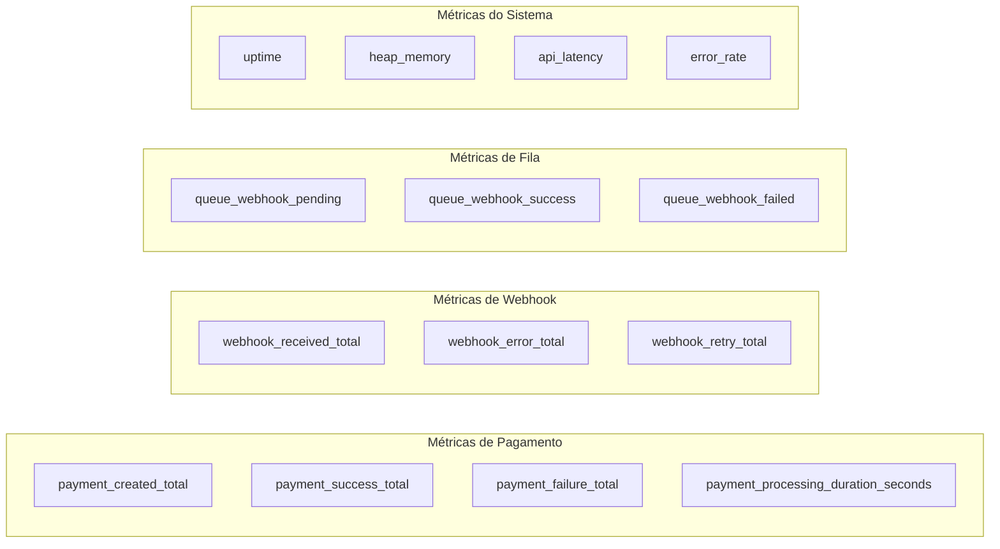
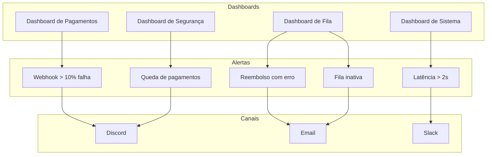
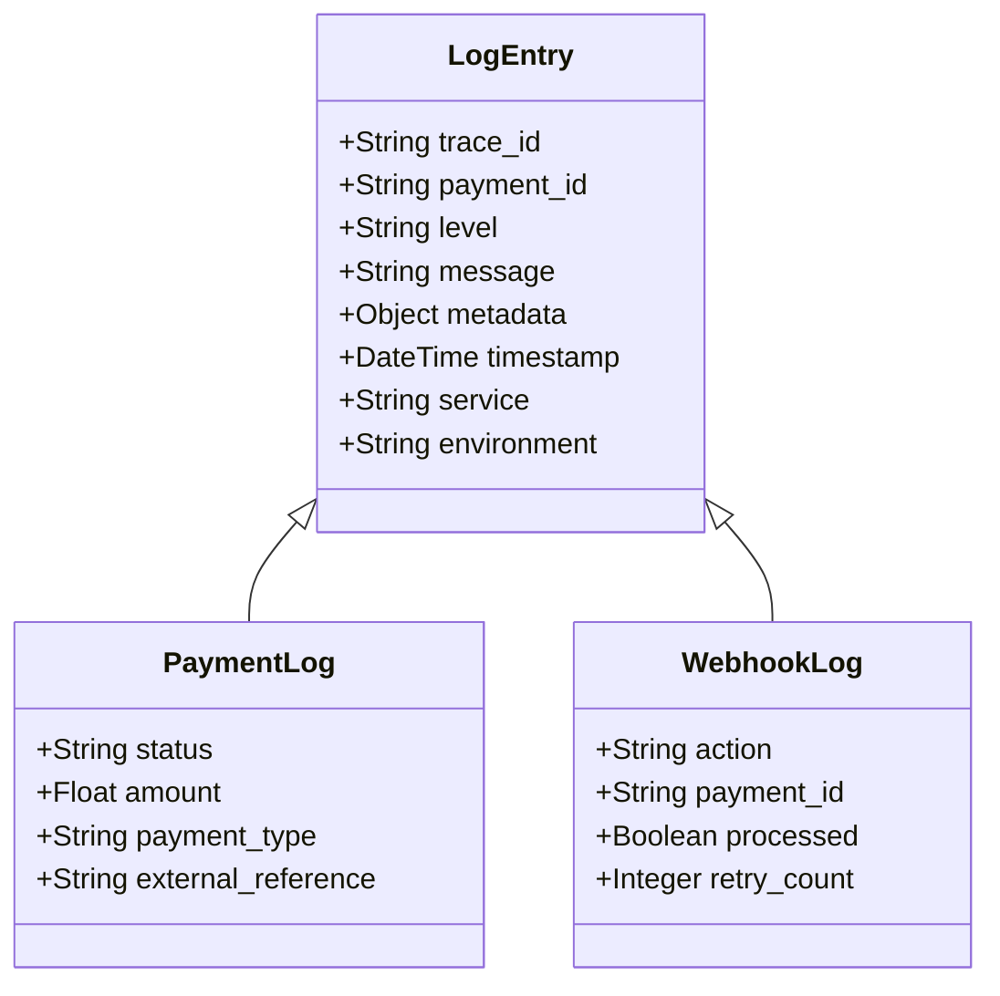

# Arquitetura de Observabilidade do OnlyWave

Este diagrama ilustra a arquitetura completa de observabilidade do sistema OnlyWave, incluindo coleta de logs, métricas, alertas e dashboards.

## Visão Geral da Observabilidade

## Fluxo de Coleta de Logs

## Métricas do Sistema

## Dashboards e Alertas

## Estrutura de Logs

## Componentes da Observabilidade

### Logging
- **Winston**: Logger estruturado
- **ElasticSearch**: Armazenamento e busca
- **Kibana**: Visualização de logs
- **Log Rotation**: Gerenciamento de arquivos

### Métricas
- **Prometheus**: Coleta de métricas
- **Grafana**: Visualização e alertas
- **Custom Metrics**: Métricas específicas de negócio
- **System Metrics**: Métricas de infraestrutura

### Rastreabilidade
- **Trace ID**: Identificador único por requisição
- **Payment ID**: Rastreamento de pagamentos
- **Correlation ID**: Correlação entre serviços
- **Span ID**: Rastreamento de operações

### Alertas
- **Thresholds**: Limites para alertas
- **Severity**: Níveis de severidade
- **Channels**: Canais de notificação
- **Escalation**: Escalação de alertas 