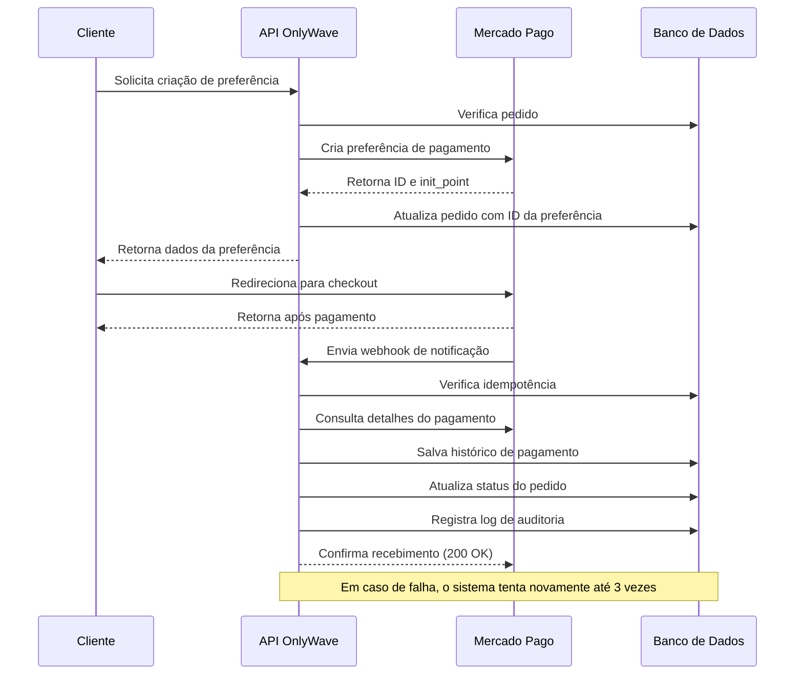
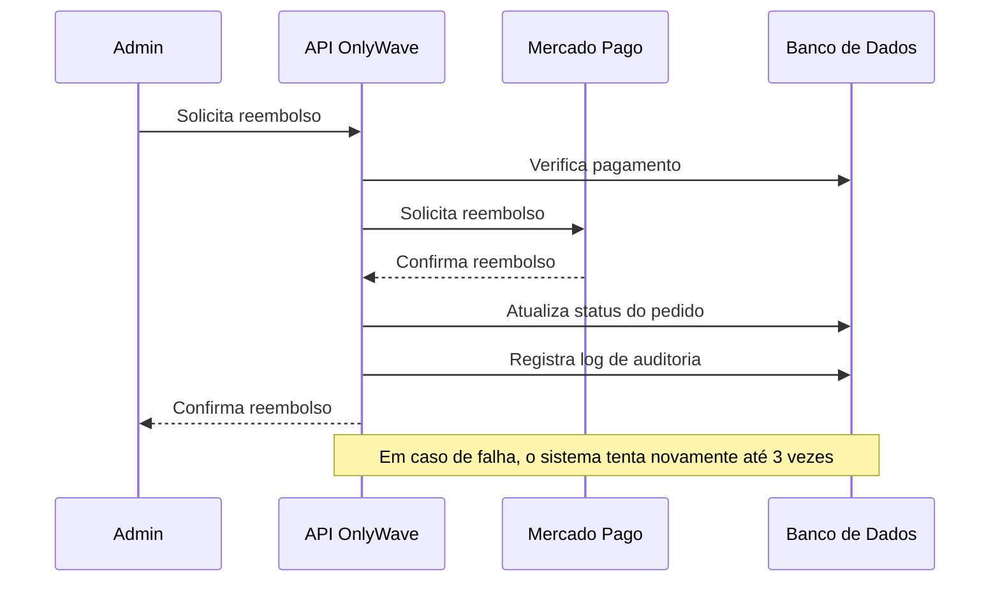
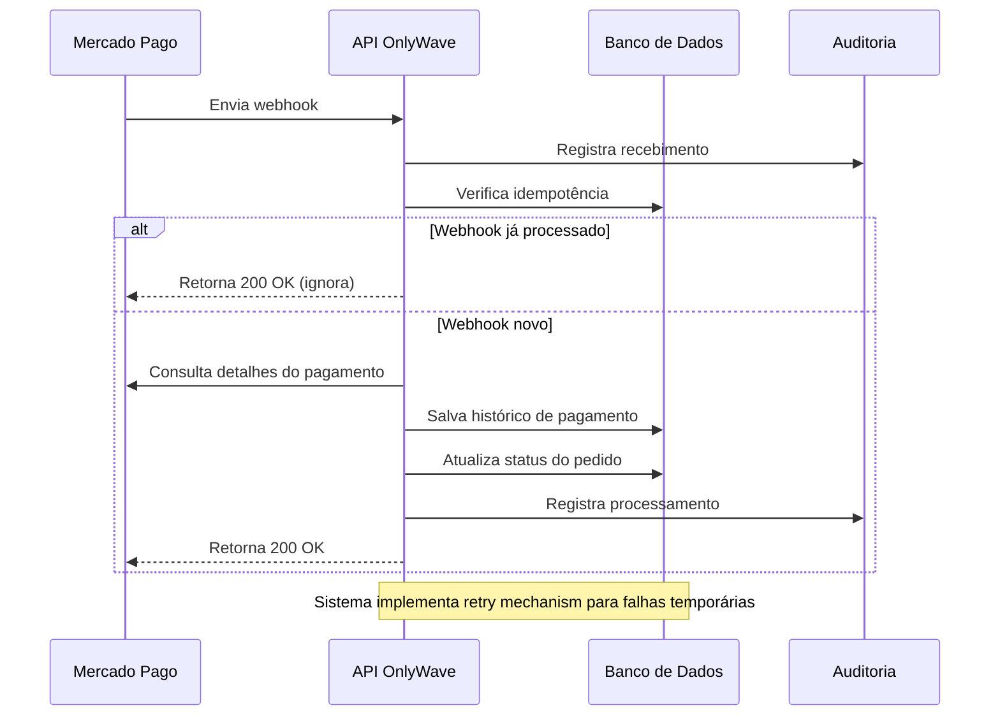

# Fluxo de Pagamento

Este diagrama ilustra o fluxo completo de pagamento no sistema OnlyWave, desde a criação da preferência até o processamento do webhook.

## Fluxo de Reembolso

## Fluxo de Webhook

