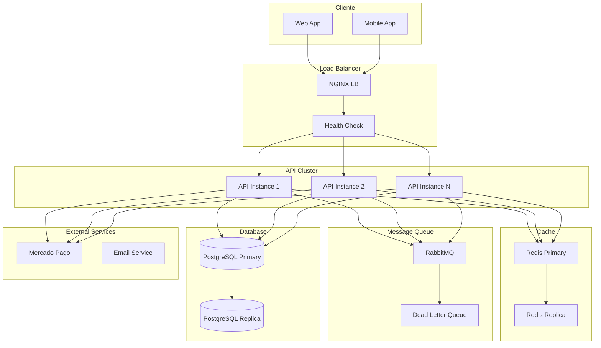
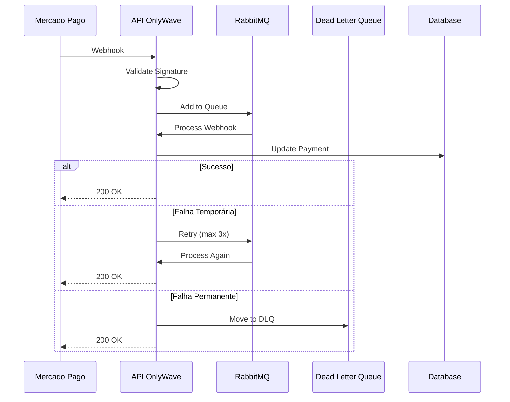
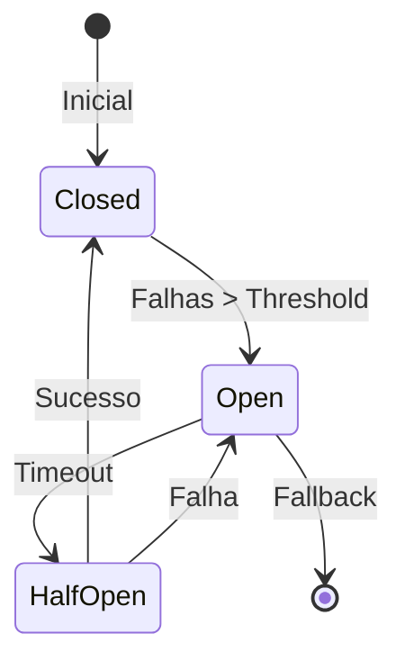
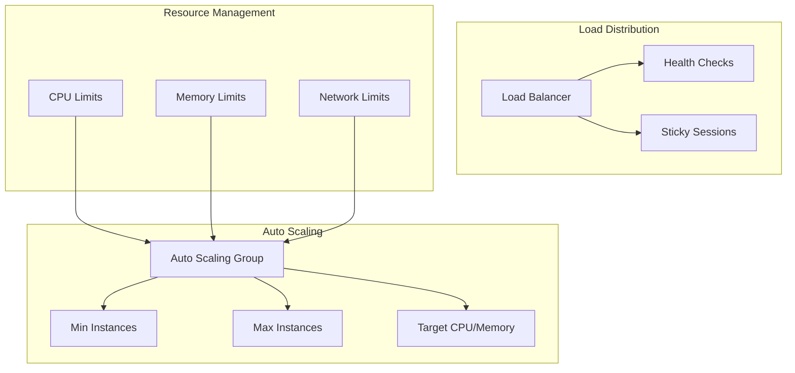

# Arquitetura de Resiliência e Escalabilidade do OnlyWave

Este diagrama ilustra como o sistema OnlyWave lida com falhas, escala e mantém alta disponibilidade.

## Visão Geral da Arquitetura Resiliente

## Fluxo de Webhook com Retry

## Circuit Breaker para Serviços Externos

## Estratégia de Escalabilidade

## Componentes da Resiliência

### Retry e Backoff
- **Webhook Processing**: Retry com backoff exponencial
- **API Calls**: Circuit breaker com fallback
- **Queue Processing**: Dead letter queue para falhas

### Cache e Performance
- **Redis Cluster**: Cache distribuído
- **Session Storage**: Dados de sessão
- **Rate Limiting**: Proteção contra abusos

### Banco de Dados
- **Primary/Replica**: Alta disponibilidade
- **Connection Pool**: Gerenciamento de conexões
- **Query Optimization**: Índices e cache

### Monitoramento
- **Health Checks**: Verificação de saúde
- **Metrics**: Métricas de resiliência
- **Alerts**: Alertas de falhas 