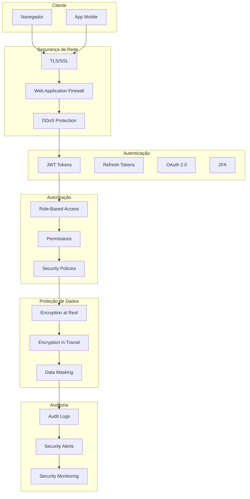
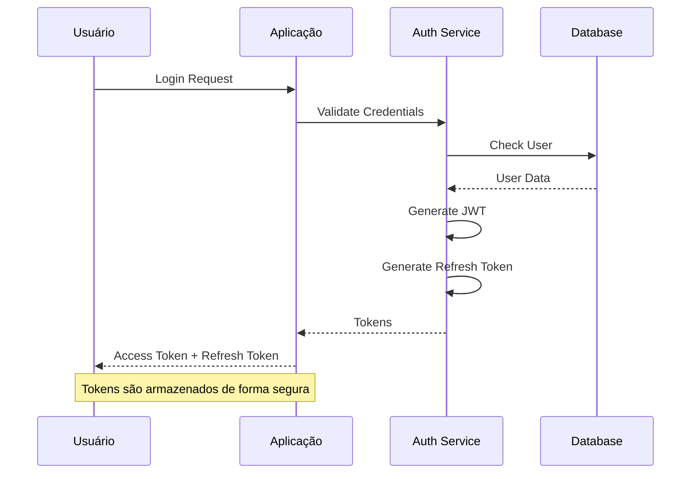
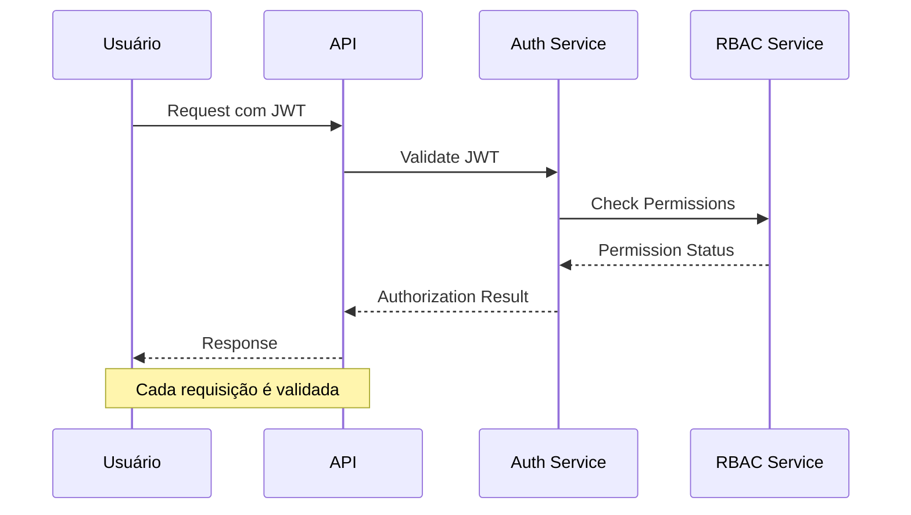
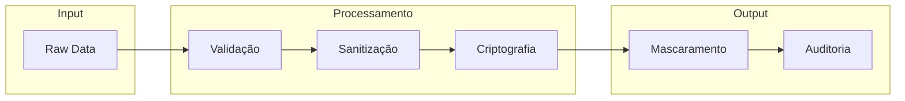

# Arquitetura de Segurança do OnlyWave

Este diagrama ilustra a arquitetura de segurança do sistema OnlyWave, incluindo autenticação, autorização e proteção de dados.

## Componentes de Segurança

### Segurança de Rede
- **WAF**: Proteção contra ataques web
- **DDoS Protection**: Mitigação de ataques DDoS
- **TLS/SSL**: Criptografia de comunicação

### Autenticação
- **JWT**: Tokens de acesso
- **Refresh Tokens**: Renovação de sessão
- **OAuth 2.0**: Autenticação de terceiros
- **2FA**: Autenticação em dois fatores

### Autorização
- **RBAC**: Controle de acesso baseado em funções
- **Permissions**: Permissões granulares
- **Security Policies**: Políticas de segurança

### Proteção de Dados
- **Encryption at Rest**: Criptografia de dados armazenados
- **Encryption in Transit**: Criptografia em trânsito
- **Data Masking**: Mascaramento de dados sensíveis

### Auditoria
- **Audit Logs**: Registro de atividades
- **Security Alerts**: Alertas de segurança
- **Security Monitoring**: Monitoramento contínuo

## Fluxo de Autenticação

## Fluxo de Autorização

## Proteção de Dados Sensíveis

