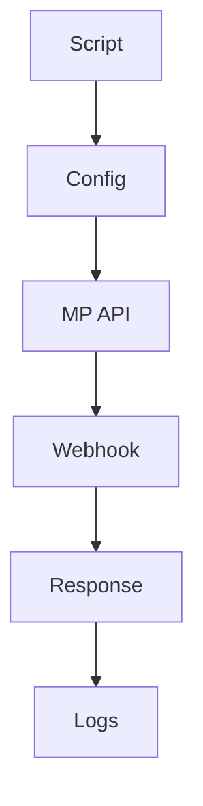

# Documentação Técnica - Kit de Operações de Pagamento

## 📋 Sumário

1. [Visão Geral](#visão-geral)
2. [Arquitetura](#arquitetura)
3. [Scripts](#scripts)
4. [Configuração](#configuração)
5. [Segurança](#segurança)
6. [Operações](#operações)
7. [Manutenção](#manutenção)
8. [Referências](#referências)

## 🎯 Visão Geral

O Kit de Operações de Pagamento é um conjunto de ferramentas para gerenciamento e manutenção do módulo de pagamentos integrado com o Mercado Pago. Este kit permite:

- Reprocessamento de webhooks
- Simulação de eventos
- Processamento em lote
- Diagnóstico de problemas
- Validação de configurações

## 🏗️ Arquitetura

### Componentes

```
payment-scripts/
├── reprocess-webhook.js    # Reprocessamento individual
├── reprocess-batch.js      # Processamento em lote
├── simulate-webhook.js     # Simulação de eventos
├── package.json           # Dependências
├── config.json           # Configurações
├── payments.json         # Template para lote
└── README.md            # Documentação
```

### Fluxo de Dados



## 🛠️ Scripts

### 1. Reprocessamento Individual

**Arquivo:** `reprocess-webhook.js`

**Uso:**
```bash
npm run reprocess -- 123456789
```

**Funcionalidades:**
- Busca dados do pagamento
- Gera assinatura HMAC-SHA256
- Envia webhook
- Valida resposta

### 2. Processamento em Lote

**Arquivo:** `reprocess-batch.js`

**Uso:**
```bash
npm run reprocess-batch -- --file=payments.json
```

**Funcionalidades:**
- Processa múltiplos pagamentos
- Relatório de sucesso/falha
- Logs detalhados
- Tratamento de erros

### 3. Simulação de Eventos

**Arquivo:** `simulate-webhook.js`

**Uso:**
```bash
npm run simulate -- --paymentId=123456789 --status=approved
```

**Status Disponíveis:**
- `approved`
- `pending`
- `rejected`
- `cancelled`
- `refunded`

## ⚙️ Configuração

### Ambiente

```json
{
  "development": {
    "mpAccessToken": "TEST-...",
    "webhookUrl": "http://localhost:3000/api/payment/webhook",
    "webhookSecret": "your-webhook-secret-here"
  },
  "production": {
    "mpAccessToken": "APP-...",
    "webhookUrl": "https://api.seudominio.com/api/payment/webhook",
    "webhookSecret": "your-production-webhook-secret-here"
  }
}
```

### Dependências

```json
{
  "dependencies": {
    "axios": "^1.6.7",
    "chalk": "^4.1.2"
  }
}
```

## 🔐 Segurança

### Tokens e Segredos

- Armazenados em `config.json`
- Nunca commitados no repositório
- Validados antes do uso
- Rotacionados periodicamente

### Assinatura de Webhooks

```javascript
const signature = crypto
  .createHmac('sha256', webhookSecret)
  .update(JSON.stringify(payload))
  .digest('hex');
```

### Validações

- Token do Mercado Pago
- URL do webhook
- Assinatura HMAC-SHA256
- Resposta do servidor

## 🔄 Operações

### Fluxo de Reprocessamento

1. **Validação**
   - Verifica configurações
   - Valida token
   - Checa ambiente

2. **Processamento**
   - Busca dados
   - Gera assinatura
   - Envia webhook

3. **Validação**
   - Verifica resposta
   - Registra logs
   - Reporta resultado

### Logs

- 🟢 Verde: Sucesso
- 🔵 Azul: Informação
- 🟡 Amarelo: Debug/Aviso
- 🔴 Vermelho: Erro

## 🔧 Manutenção

### Atualizações

1. **Dependências**
   ```bash
   npm update
   ```

2. **Configurações**
   - Atualizar tokens
   - Verificar URLs
   - Validar segredos

3. **Scripts**
   - Manter compatibilidade
   - Documentar mudanças
   - Testar alterações

### Monitoramento

- Logs de execução
- Taxa de sucesso
- Tempo de resposta
- Erros frequentes

## 📚 Referências

### Documentação

- [README.md](README.md)
- [TROUBLESHOOTING.md](TROUBLESHOOTING.md)
- [API Mercado Pago](https://www.mercadopago.com.br/developers/pt-BR/docs)
- [Webhooks MP](https://www.mercadopago.com.br/developers/pt-BR/docs/notifications/webhooks)

### Suporte

- Issues no repositório
- Documentação técnica
- Equipe de desenvolvimento
- Suporte Mercado Pago

## 📝 Notas de Versão

### v1.0.0

- ✅ Reprocessamento individual
- ✅ Processamento em lote
- ✅ Simulação de eventos
- ✅ Logs coloridos
- ✅ Modo debug
- ✅ Documentação completa 