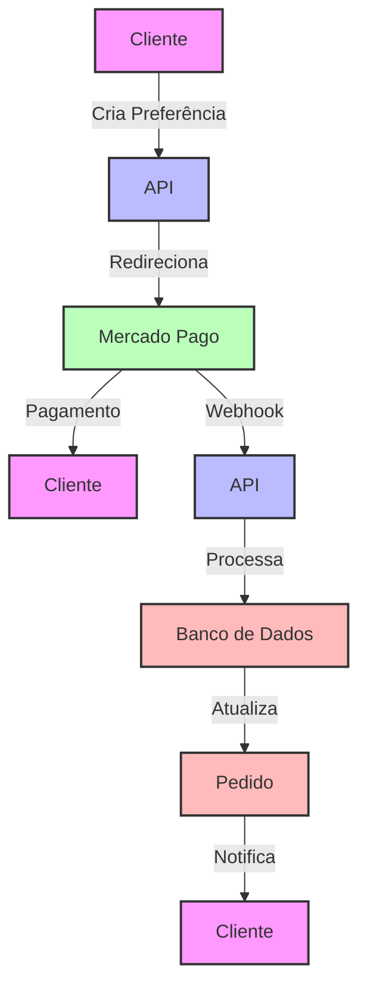
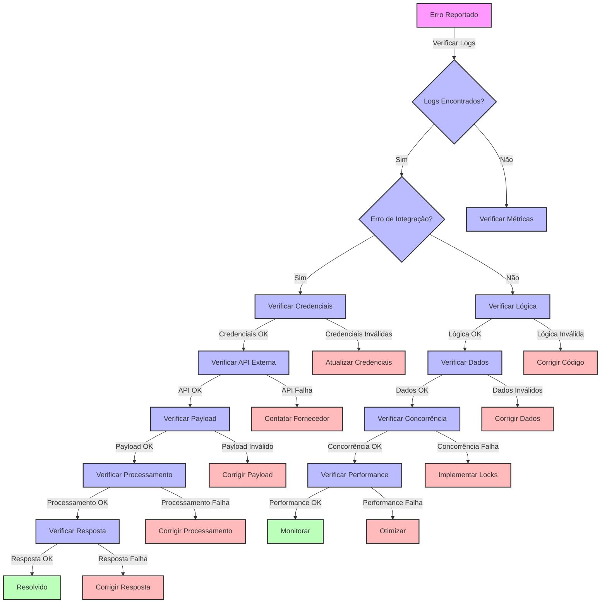
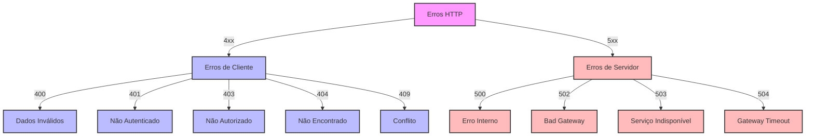

# Guia de Troubleshooting - Módulo de Pagamentos OnlyWave

## Índice
1. [Problemas Comuns](#problemas-comuns)
2. [Diagnóstico](#diagnóstico)
3. [Diagnóstico Avançado](#diagnóstico-avançado)
4. [Root Cause Analysis (RCA)](#root-cause-analysis-rca)
5. [Fluxogramas de Diagnóstico](#fluxogramas-de-diagnóstico)
6. [Tabela de Erros Comuns](#tabela-de-erros-comuns)
7. [Tabela de Sintoma x Causa Provável](#tabela-de-sintoma-x-causa-provável)
8. [Soluções](#soluções)
9. [Procedimentos Pós-Falha](#procedimentos-pós-falha)
10. [Análise de Performance](#análise-de-performance)
11. [Incidentes Realmente Aconteceram](#incidentes-realmente-aconteceram)
12. [Pronto para Produção?](#pronto-para-produção)
13. [Prevenção](#prevenção)

## Problemas Comuns

### 1. Erros de Autenticação

#### Token Inválido
- **Sintomas**: 
  - Erro 401 Unauthorized
  - Mensagem "Token inválido ou expirado"
- **Causas**:
  - Token expirado
  - Assinatura inválida
  - Token revogado
- **Verificação**:
  ```bash
  # Verificar blacklist
  curl -X GET /api/v1/auth/blacklist/check
  ```

#### Permissões Insuficientes
- **Sintomas**:
  - Erro 403 Forbidden
  - Mensagem "Permissão negada"
- **Causas**:
  - Role incorreta
  - Escopo insuficiente
  - Ambiente errado
- **Verificação**:
  ```bash
  # Verificar permissões
  curl -X GET /api/v1/auth/permissions
  ```

### 2. Erros de Pagamento

#### Falha na Criação de Preferência
- **Sintomas**:
  - Erro 400 Bad Request
  - Mensagem "Dados inválidos"
- **Causas**:
  - Campos obrigatórios faltando
  - Valores inválidos
  - Formato incorreto
- **Verificação**:
  ```bash
  # Validar payload
  curl -X POST /api/v1/payments/preferences/validate
  ```

#### Webhook Não Processado
- **Sintomas**:
  - Erro 400 Bad Request
  - Mensagem "Assinatura inválida"
- **Causas**:
  - Assinatura incorreta
  - Payload modificado
  - Timestamp expirado
- **Verificação**:
  ```bash
  # Verificar logs
  curl -X GET /api/v1/payments/webhooks/logs
  ```

#### Reembolso Falhou
- **Sintomas**:
  - Erro 400 Bad Request
  - Mensagem "Reembolso não permitido"
- **Causas**:
  - Pagamento não aprovado
  - Valor excede limite
  - Período expirado
- **Verificação**:
  ```bash
  # Verificar status
  curl -X GET /api/v1/payments/{id}/status
  ```

### 3. Problemas de Performance

#### Alta Latência
- **Sintomas**:
  - Tempo de resposta > 500ms
  - Timeouts frequentes
- **Causas**:
  - Sobrecarga do banco
  - Cache inválido
  - Rate limit
- **Verificação**:
  ```bash
  # Verificar métricas
  curl -X GET /api/v1/metrics
  ```

#### Erros de Concorrência
- **Sintomas**:
  - Erro 409 Conflict
  - Mensagem "Recurso bloqueado"
- **Causas**:
  - Locks simultâneos
  - Race conditions
  - Deadlocks
- **Verificação**:
  ```bash
  # Verificar locks
  curl -X GET /api/v1/payments/locks
  ```

## Diagnóstico

### 1. Logs

#### Estrutura
```json
{
  "timestamp": "2024-04-16T17:57:37Z",
  "level": "ERROR",
  "service": "payment",
  "trace_id": "abc123",
  "message": "Falha no processamento",
  "details": {
    "error": "InvalidSignature",
    "payment_id": "123456",
    "amount": 100.00
  }
}
```

#### Níveis
- ERROR: Falhas críticas
- WARN: Problemas não críticos
- INFO: Operações normais
- DEBUG: Detalhes técnicos

### 2. Métricas

#### Principais
- Latência p95 < 500ms
- Taxa de erro < 0.1%
- CPU < 70%
- Memória < 80%

#### Alertas
- Latência > 1s
- Erro > 1%
- CPU > 90%
- Memória > 90%

### 3. Traces

#### Spans
- Início da requisição
- Validação de dados
- Processamento
- Resposta

#### Tags
- payment_id
- user_id
- operation
- status

## Diagnóstico Avançado

### 1. Análise de Logs por Identificadores

#### Por PaymentId
```bash
# Buscar logs por paymentId
grep "paymentId: 1234567890" /var/log/onlywave/payment.log

# Buscar logs por external_reference
grep "external_reference: PED-123" /var/log/onlywave/payment.log

# Buscar logs por trace_id
grep "trace_id: abc123" /var/log/onlywave/payment.log
```

#### Por Período
```bash
# Buscar logs das últimas 24 horas
find /var/log/onlywave -name "payment.log*" -mtime -1 -exec grep "ERROR" {} \;

# Buscar logs por data específica
grep "2024-04-16" /var/log/onlywave/payment.log
```

### 2. Testes de API

#### Simulação de Webhook
```bash
# Simular webhook com curl
curl -X POST http://localhost:3000/payment/webhook \
  -H "Content-Type: application/json" \
  -H "X-Signature: sha256=..." \
  -d '{"action":"payment.updated","data":{"id":"123"}}'

# Verificar resposta
echo $?
```

#### Verificação de Preferência
```bash
# Verificar preferência existente
curl -X GET http://localhost:3000/payment/preference/123 \
  -H "Authorization: Bearer $TOKEN"

# Verificar status de pagamento
curl -X GET http://localhost:3000/payment/status/123 \
  -H "Authorization: Bearer $TOKEN"
```

### 3. Verificação de Banco de Dados

#### Consultas de Diagnóstico
```sql
-- Verificar pagamentos pendentes
SELECT * FROM payments WHERE status = 'PENDING' AND created_at > NOW() - INTERVAL '24 HOURS';

-- Verificar webhooks não processados
SELECT * FROM webhook_logs WHERE processed = false AND created_at > NOW() - INTERVAL '24 HOURS';

-- Verificar inconsistências entre pedidos e pagamentos
SELECT p.id, p.status, pe.status FROM pedidos p 
LEFT JOIN payments pe ON p.payment_id = pe.payment_id 
WHERE p.status != pe.status;
```

## Root Cause Analysis (RCA)

### 1. Checklist para Falhas de Webhook

- [ ] O webhook foi recebido pelo servidor?
  ```bash
  grep "Webhook recebido" /var/log/onlywave/payment.log | grep "paymentId: 1234567890"
  ```
- [ ] A assinatura do webhook era válida?
  ```bash
  grep "Assinatura válida" /var/log/onlywave/payment.log | grep "paymentId: 1234567890"
  ```
- [ ] O pagamento retornado do Mercado Pago continha `external_reference`?
  ```bash
  grep "external_reference" /var/log/onlywave/payment.log | grep "paymentId: 1234567890"
  ```
- [ ] O pedido foi atualizado no banco de dados?
  ```sql
  SELECT * FROM pedidos WHERE payment_id = '1234567890';
  ```
- [ ] O erro foi capturado no log?
  ```bash
  grep "ERROR" /var/log/onlywave/payment.log | grep "paymentId: 1234567890"
  ```

### 2. Checklist para Falhas de Reembolso

- [ ] O pagamento existe no Mercado Pago?
  ```bash
  curl -X GET https://api.mercadopago.com/v1/payments/1234567890 \
    -H "Authorization: Bearer $MP_ACCESS_TOKEN"
  ```
- [ ] O pagamento está aprovado?
  ```sql
  SELECT status FROM payments WHERE payment_id = '1234567890';
  ```
- [ ] O valor do reembolso é válido?
  ```sql
  SELECT transaction_amount FROM payments WHERE payment_id = '1234567890';
  ```
- [ ] O pedido foi atualizado após o reembolso?
  ```sql
  SELECT status FROM pedidos WHERE payment_id = '1234567890';
  ```

### 3. Checklist para Falhas de Autenticação

- [ ] O token está expirado?
  ```bash
  curl -X GET /api/v1/auth/token/check -H "Authorization: Bearer $TOKEN"
  ```
- [ ] O token está na blacklist?
  ```bash
  curl -X GET /api/v1/auth/blacklist/check -H "Authorization: Bearer $TOKEN"
  ```
- [ ] O usuário tem as permissões necessárias?
  ```bash
  curl -X GET /api/v1/auth/permissions -H "Authorization: Bearer $TOKEN"
  ```

## Fluxogramas de Diagnóstico

### 1. Ciclo de Vida de Pagamento



### 2. Diagnóstico de Erros



### 3. Tipos de Erros



## Tabela de Erros Comuns

| Código | Descrição                       | Solução                                     |
|--------|----------------------------------|---------------------------------------------|
| 400    | Dados inválidos                 | Verificar formato e valores do payload      |
| 401    | Token do Mercado Pago inválido  | Verificar variável `ACCESS_TOKEN`           |
| 403    | Permissão negada                | Validar escopo e permissões da aplicação    |
| 404    | Recurso não encontrado          | Verificar IDs e existência no banco         |
| 409    | Pagamento já reembolsado        | Verificar status no Mercado Pago            |
| 429    | Rate limit excedido             | Aguardar ou aumentar limites                |
| 500    | Falha ao processar webhook      | Verificar logs e reprocessar manualmente    |
| 502    | Bad Gateway                     | Verificar conexão com Mercado Pago          |
| 503    | Serviço indisponível            | Verificar status do serviço                 |
| 504    | Gateway Timeout                 | Verificar timeouts e conexões               |

## Tabela de Sintoma x Causa Provável

| Sintoma                                | Causa Provável                               | Diagnóstico                           |
|----------------------------------------|-----------------------------------------------|----------------------------------------|
| Status do pedido não atualiza          | Webhook falhou / assinatura inválida          | Verifique logs e reenvie manualmente   |
| Reembolso retorna erro 409             | Pagamento já reembolsado                      | Valide status com GET /payment/:id     |
| API demora para responder              | Fila cheia / banco com lock                   | Verifique tempo de resposta e métricas |
| Erro 401 em todas as requisições       | Token expirado / revogado                     | Verifique blacklist e renove token     |
| Erro 403 em operações específicas      | Permissões insuficientes                      | Verifique roles e escopo do usuário    |
| Pagamentos duplicados                  | Falha na idempotência                         | Verifique webhook_logs e reprocesse    |
| Erro 500 ao criar preferência          | Falha na conexão com Mercado Pago             | Verifique credenciais e conectividade  |
| Erro 502 em webhooks                   | Timeout na chamada ao MP                       | Aumente timeout e verifique latência   |
| Erro 503 em picos de demanda           | Sobrecarga do banco de dados                  | Verifique métricas e escalabilidade    |
| Erro 504 em operações longas           | Timeout na operação                           | Otimize queries e aumente timeouts     |

## Soluções

### 1. Autenticação

#### Token Expirado
1. Solicitar novo token
2. Verificar refresh token
3. Limpar cache
4. Atualizar credenciais

#### Permissões
1. Verificar roles
2. Atualizar escopo
3. Limpar cache
4. Reautenticar

### 2. Pagamento

#### Preferência
1. Validar dados
2. Verificar limites
3. Limpar cache
4. Reprocessar

#### Webhook
1. Verificar assinatura
2. Validar payload
3. Reprocessar
4. Notificar MP

#### Reembolso
1. Verificar status
2. Validar valor
3. Reprocessar
4. Notificar cliente

### 3. Performance

#### Latência
1. Verificar índices
2. Limpar cache
3. Ajustar timeouts
4. Escalar recursos

#### Concorrência
1. Liberar locks
2. Ajustar timeouts
3. Reprocessar
4. Monitorar

## Procedimentos Pós-Falha

### 1. Reprocessamento de Webhooks

#### Usando Script
```bash
# Reprocessar webhook específico
node scripts/reprocess-webhook.js --paymentId=123456789

# Reprocessar webhooks em lote
node scripts/reprocess-webhook.js --file=webhooks.json

# Reprocessar webhooks por período
node scripts/reprocess-webhook.js --start=2024-04-01 --end=2024-04-16
```

#### Verificação Manual
```bash
# Verificar status do pagamento no MP
curl -X GET https://api.mercadopago.com/v1/payments/123456789 \
  -H "Authorization: Bearer $MP_ACCESS_TOKEN"

# Verificar status no banco
SELECT * FROM payments WHERE payment_id = '123456789';
```

### 2. Identificação de Pagamentos Não Atualizados

#### Consultas SQL
```sql
-- Pagamentos sem status
SELECT * FROM payments WHERE status IS NULL AND created_at > NOW() - INTERVAL '24 HOURS';

-- Pagamentos pendentes há mais de 1 hora
SELECT * FROM payments WHERE status = 'PENDING' AND created_at < NOW() - INTERVAL '1 HOUR';

-- Inconsistências entre pedidos e pagamentos
SELECT p.id, p.status, pe.status FROM pedidos p 
LEFT JOIN payments pe ON p.payment_id = pe.payment_id 
WHERE p.status != pe.status;
```

#### Script de Verificação
```bash
# Verificar pagamentos não processados
node scripts/check-payments.js --unprocessed

# Verificar inconsistências
node scripts/check-payments.js --inconsistent

# Gerar relatório
node scripts/check-payments.js --report
```

### 3. Recuperação de Dados

#### Backup e Restauração
```bash
# Fazer backup do banco
pg_dump -U onlywave -d onlywave > backup_$(date +%Y%m%d).sql

# Restaurar backup
psql -U onlywave -d onlywave < backup_20240416.sql
```

#### Correção de Dados
```sql
-- Corrigir status de pagamento
UPDATE payments SET status = 'APPROVED' WHERE payment_id = '123456789';

-- Corrigir status de pedido
UPDATE pedidos SET status = 'PAID' WHERE payment_id = '123456789';

-- Marcar webhook como processado
UPDATE webhook_logs SET processed = true WHERE payment_id = '123456789';
```

## Análise de Performance

### 1. Dashboards Recomendados

#### Prometheus/Grafana
- **Taxa de Sucesso de Webhooks**
  - Métrica: `webhook_success_rate`
  - Alerta: < 95%
  - Visualização: Gráfico de linha

- **Tempo Médio de Processamento**
  - Métrica: `webhook_processing_time`
  - Alerta: > 500ms
  - Visualização: Histograma

- **Picos de Retry**
  - Métrica: `webhook_retry_count`
  - Alerta: > 3
  - Visualização: Gráfico de barras

- **Erros por Código HTTP**
  - Métrica: `http_error_count`
  - Alerta: > 10/min
  - Visualização: Gráfico de pizza

### 2. Consultas de Performance

#### Análise de Latência
```sql
-- Tempo médio de processamento por operação
SELECT 
  operation, 
  AVG(EXTRACT(EPOCH FROM (finished_at - started_at))) as avg_time_seconds
FROM operation_logs
WHERE started_at > NOW() - INTERVAL '24 HOURS'
GROUP BY operation
ORDER BY avg_time_seconds DESC;

-- Operações mais lentas
SELECT 
  operation, 
  payment_id,
  EXTRACT(EPOCH FROM (finished_at - started_at)) as time_seconds
FROM operation_logs
WHERE started_at > NOW() - INTERVAL '24 HOURS'
ORDER BY time_seconds DESC
LIMIT 10;
```

#### Análise de Erros
```sql
-- Taxa de erro por operação
SELECT 
  operation, 
  COUNT(*) as total,
  SUM(CASE WHEN error IS NOT NULL THEN 1 ELSE 0 END) as errors,
  ROUND(SUM(CASE WHEN error IS NOT NULL THEN 1 ELSE 0 END)::NUMERIC / COUNT(*)::NUMERIC * 100, 2) as error_rate
FROM operation_logs
WHERE started_at > NOW() - INTERVAL '24 HOURS'
GROUP BY operation
ORDER BY error_rate DESC;

-- Erros mais frequentes
SELECT 
  error,
  COUNT(*) as count
FROM operation_logs
WHERE error IS NOT NULL AND started_at > NOW() - INTERVAL '24 HOURS'
GROUP BY error
ORDER BY count DESC
LIMIT 10;
```

### 3. Otimizações Recomendadas

#### Banco de Dados
- Adicionar índices para consultas frequentes
- Otimizar queries com EXPLAIN ANALYZE
- Implementar particionamento para logs antigos
- Configurar vacuum e analyze

#### Aplicação
- Implementar cache para dados estáticos
- Otimizar processamento assíncrono
- Ajustar timeouts e retries
- Implementar circuit breakers

## Incidentes Realmente Aconteceram

### Incidente #1: Falha em Lote de Webhooks

#### Data: 15/03/2024
#### Duração: 2 horas
#### Impacto: 47 pedidos não atualizados

**Causa:**
- Falha na conexão com o banco de dados durante pico de demanda
- Sistema de retry não funcionou corretamente devido a configuração incorreta
- Logs não foram suficientes para identificar o problema rapidamente

**Passos de Mitigação:**
1. Identificação via dashboard de métricas (pico de erros 500)
2. Verificação de logs revelou timeouts no banco
3. Execução do script de reprocessamento em lote:
   ```bash
   node scripts/reprocess-webhook.js --file=webhooks_20240315.json
   ```
4. Correção da configuração de retry e aumento do pool de conexões

**Tempo de Resolução:** 2 horas

**Lições Aprendidas:**
- Implementar circuit breaker para operações de banco
- Melhorar logs com mais contexto
- Criar alerta específico para falhas em lote
- Revisar configurações de retry mensalmente

### Incidente #2: Reembolsos Duplicados

#### Data: 22/02/2024
#### Duração: 45 minutos
#### Impacto: 3 pedidos reembolsados duas vezes

**Causa:**
- Race condition no processamento de reembolsos
- Falha na verificação de idempotência
- Ausência de lock no registro de reembolso

**Passos de Mitigação:**
1. Identificação via relatório de inconsistências
2. Bloqueio imediato do endpoint de reembolso
3. Correção manual dos dados:
   ```sql
   UPDATE payments SET status = 'REFUNDED' WHERE payment_id IN ('123456', '123457', '123458');
   ```
4. Implementação de lock distribuído para reembolsos

**Tempo de Resolução:** 45 minutos

**Lições Aprendidas:**
- Implementar verificação de idempotência em todos os endpoints
- Adicionar locks para operações críticas
- Criar teste específico para concorrência
- Revisar código com foco em race conditions

### Incidente #3: Falha na Assinatura de Webhooks

#### Data: 10/01/2024
#### Duração: 1 hora
#### Impacto: 12 pedidos não atualizados

**Causa:**
- Atualização do algoritmo de assinatura no Mercado Pago (SHA1 para SHA256)
- Nosso sistema ainda estava configurado para SHA1
- Falha na comunicação da mudança entre equipes

**Passos de Mitigação:**
1. Identificação via logs de assinatura inválida
2. Verificação da documentação do MP revelou mudança
3. Atualização do código para suportar SHA256:
   ```javascript
   // Antes
   const signature = crypto.createHmac('sha1', webhookSecret).update(payload).digest('hex');
   
   // Depois
   const signature = crypto.createHmac('sha256', webhookSecret).update(payload).digest('hex');
   ```
4. Reprocessamento dos webhooks falhos

**Tempo de Resolução:** 1 hora

**Lições Aprendidas:**
- Implementar suporte a múltiplos algoritmos de assinatura
- Criar alerta para mudanças na documentação do MP
- Melhorar processo de comunicação entre equipes
- Adicionar teste de compatibilidade com diferentes algoritmos

## Pronto para Produção?

### Checklist de Liberação

#### Segurança
- [ ] Webhook assinado com SHA256
- [ ] Tokens com expiração adequada
- [ ] Permissões configuradas corretamente
- [ ] Dados sensíveis criptografados
- [ ] Rate limiting implementado

#### Monitoramento
- [ ] Logs estão chegando no DataDog/LogDNA?
- [ ] Métricas visíveis no dashboard?
- [ ] Alertas configurados para cenários críticos?
- [ ] Traces implementados para rastreamento?
- [ ] Dashboards de operação criados?

#### Resiliência
- [ ] Script de reprocessamento testado?
- [ ] Mecanismo de retry implementado?
- [ ] Circuit breakers configurados?
- [ ] Timeouts adequados?
- [ ] Locks para operações críticas?

#### Dados
- [ ] Índices otimizados para consultas frequentes?
- [ ] Particionamento para logs antigos?
- [ ] Backup automatizado configurado?
- [ ] Procedimento de recuperação documentado?
- [ ] Consistência entre tabelas verificada?

#### Testes
- [ ] Testes unitários com cobertura > 80%?
- [ ] Testes de integração para fluxos críticos?
- [ ] Testes de carga para cenários de pico?
- [ ] Testes de recuperação executados?
- [ ] Teste de recuperação executado no último mês?

#### Documentação
- [ ] Guia de troubleshooting atualizado?
- [ ] Procedimentos de operação documentados?
- [ ] APIs documentadas no Swagger?
- [ ] Exemplos de uso disponíveis?
- [ ] Changelog atualizado?

## Prevenção

### 1. Monitoramento

#### Logs
- Centralização
- Retenção
- Análise
- Alertas

#### Métricas
- Coleta
- Agregação
- Visualização
- Alertas

### 2. Testes

#### Unitários
- Cobertura > 80%
- Testes de erro
- Mocks
- Isolamento

#### Integração
- Fluxos completos
- Casos de erro
- Concorrência
- Performance

### 3. Documentação

#### Código
- Comentários
- Types
- Exemplos
- Changelog

#### APIs
- Swagger
- Postman
- Exemplos
- Erros

## Recursos

1. [Logs](../logs/README.md)
2. [Métricas](../metrics/README.md)
3. [Testes](../tests/README.md)
4. [APIs](../api/README.md) 