# Fluxo de Pagamento - OnlyWave

## Diagrama de Fluxo Principal

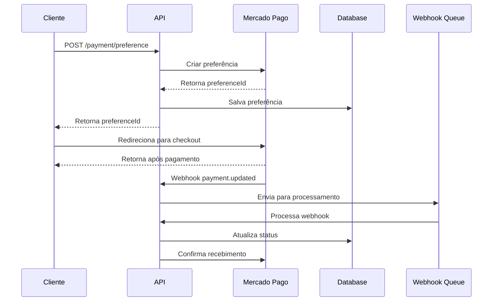

## Fluxo de Reembolso

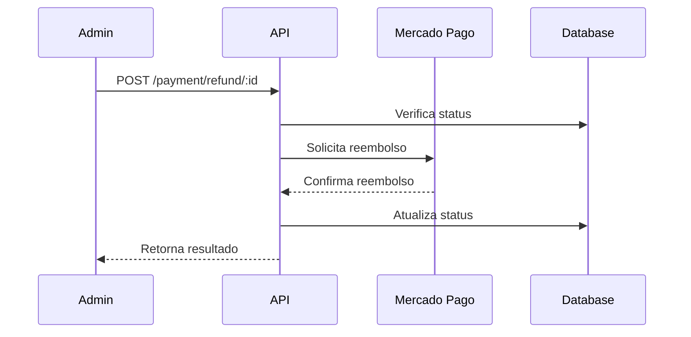

## Estados do Pagamento

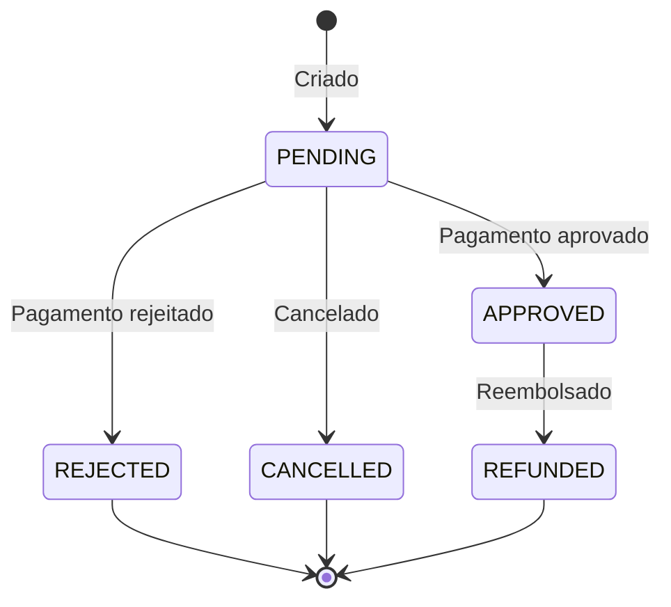

## Mecanismo de Retry

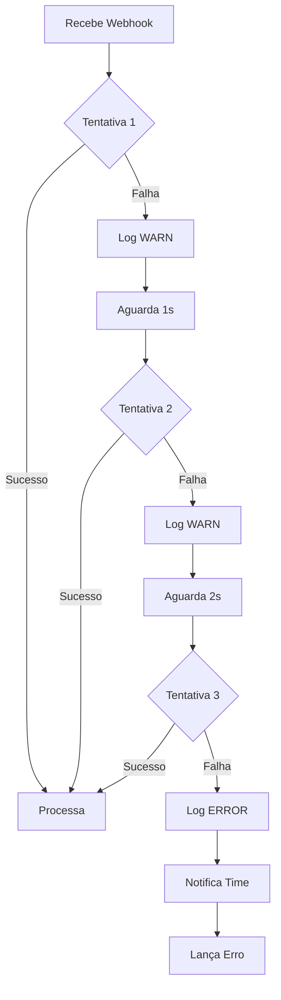

## Logs e Métricas

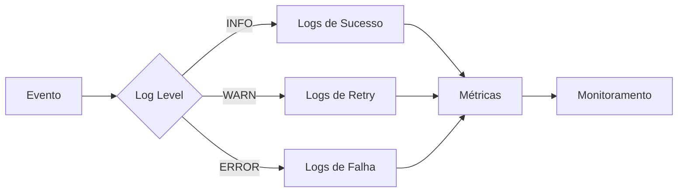

## 1. Criação de Preferência de Pagamento

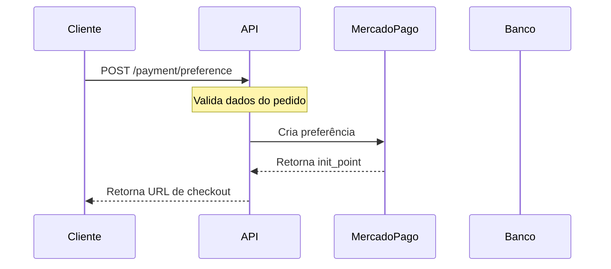

## 2. Processo de Pagamento

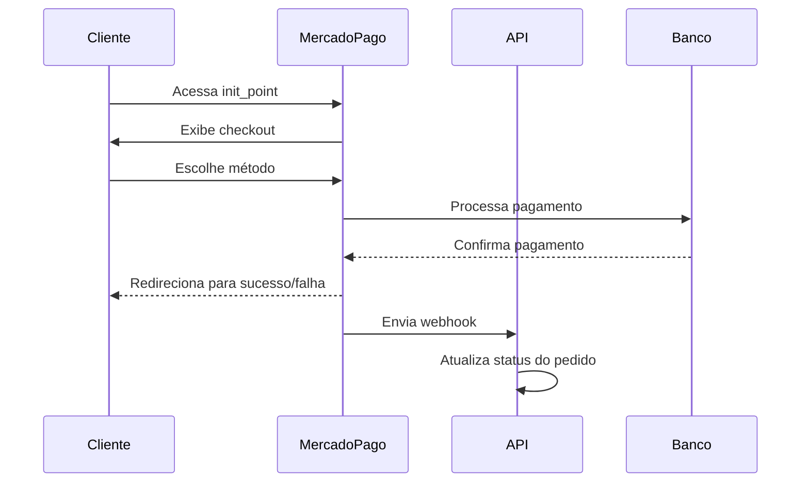

## 3. Webhook e Atualização de Status

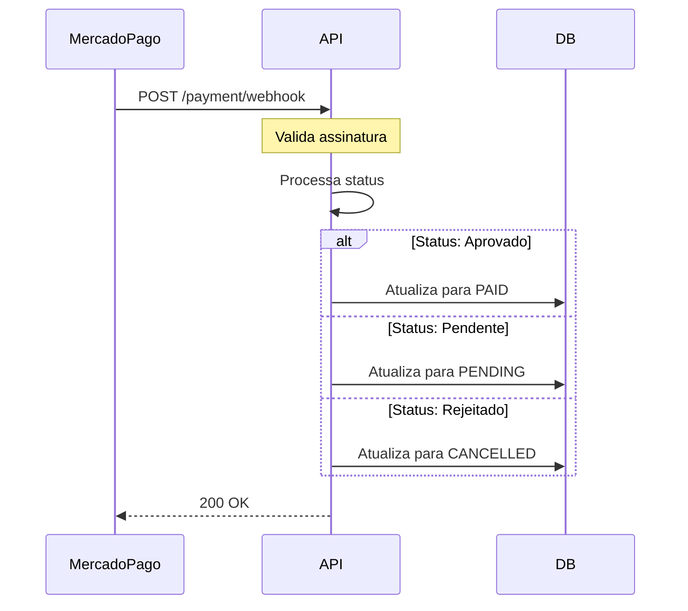

## 4. Processo de Reembolso

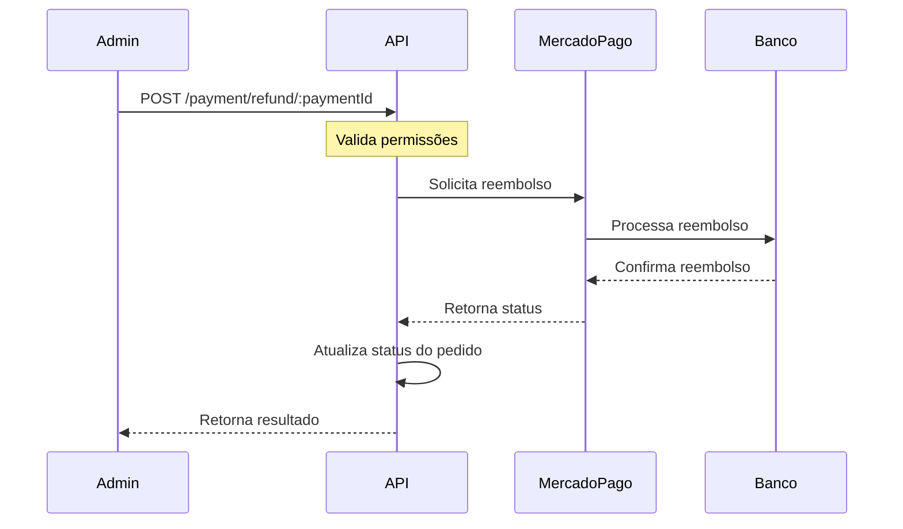

## Estados do Pagamento

| Status Mercado Pago | Status OnlyWave | Descrição |
|---------------------|-----------------|-----------|
| approved | PAID | Pagamento aprovado |
| pending | PENDING | Pagamento em análise |
| rejected | CANCELLED | Pagamento rejeitado |
| cancelled | CANCELLED | Pagamento cancelado |
| refunded | CANCELLED | Pagamento reembolsado |

## Métodos de Pagamento

1. **Cartão de Crédito**
   - Parcelamento em até 12x
   - Desconto em boleto
   - Validação 3D Secure

2. **PIX**
   - Desconto de 5%
   - QR Code dinâmico
   - Expira em 30 minutos

3. **Boleto Bancário**
   - Vencimento em 3 dias
   - Desconto de 2%
   - Código de barras e linha digitável

## Tratamento de Erros

1. **Erros de Validação (400)**
   - Dados inválidos
   - Valores incorretos
   - CPF inválido

2. **Erros de Autenticação (401)**
   - Token inválido
   - Token expirado
   - Permissões insuficientes

3. **Erros de Negócio (404)**
   - Pedido não encontrado
   - Pagamento não encontrado
   - Preferência não encontrada

4. **Erros de Serviço (500)**
   - Falha na API do Mercado Pago
   - Timeout
   - Erro interno

## Segurança

1. **Validação de Webhook**
   - Verificação de assinatura
   - Validação de origem
   - Rate limiting

2. **Proteção de Dados**
   - Dados sensíveis não são logados
   - Tokens em variáveis de ambiente
   - Criptografia em trânsito

3. **Controle de Acesso**
   - Autenticação JWT
   - Roles por endpoint
   - Validação de permissões 

# Diagrama de Fluxo - Módulo de Pagamento

## Fluxo Principal de Pagamento

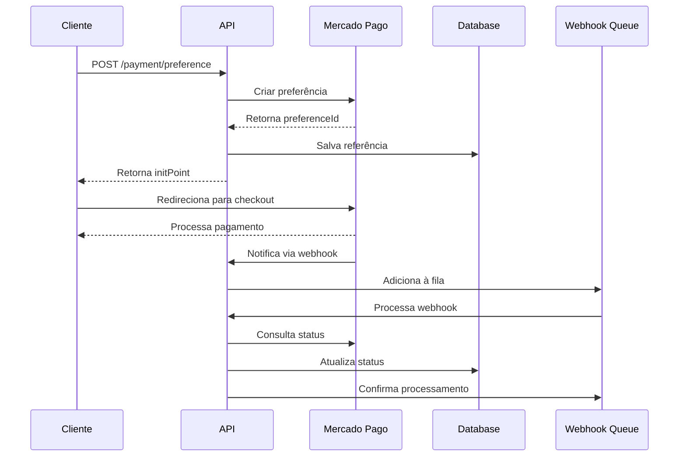

## Fluxo de Reembolso

## Estados do Pagamento

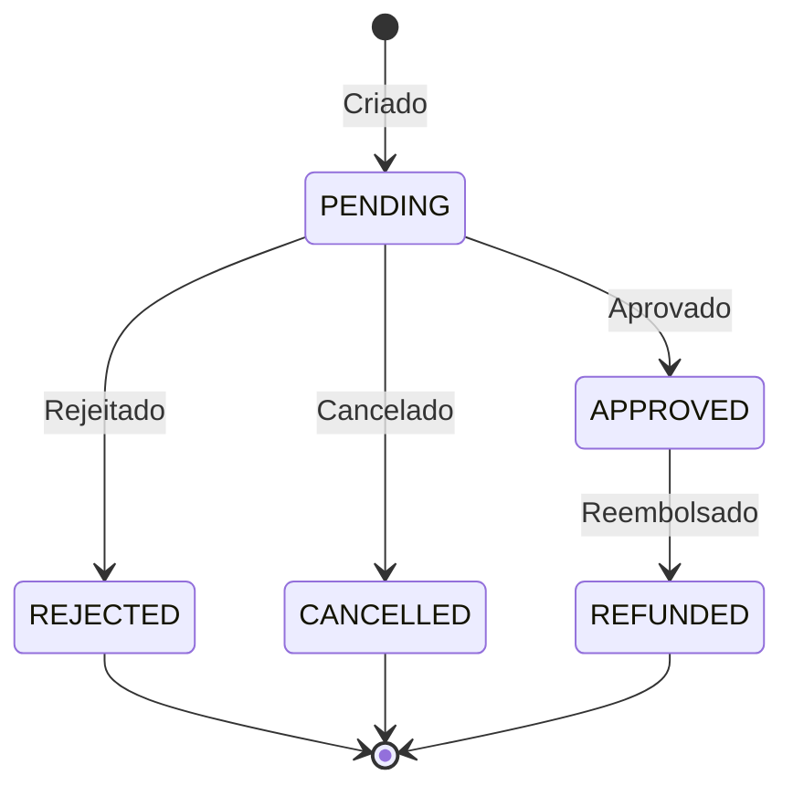

## Mecanismo de Retry

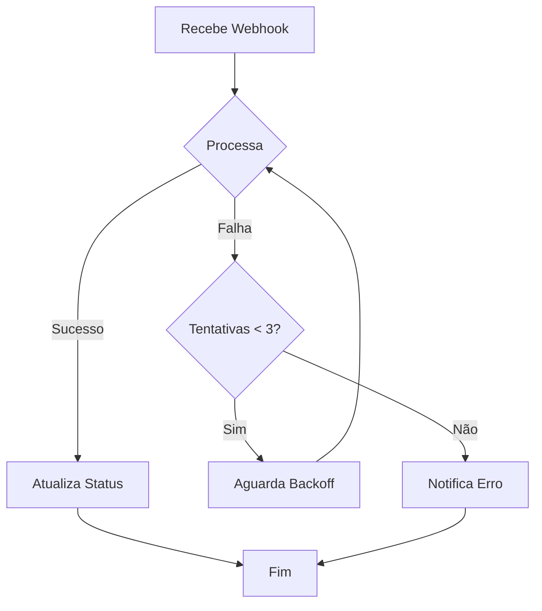

## Logs e Métricas

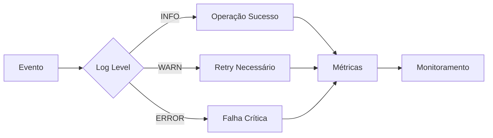