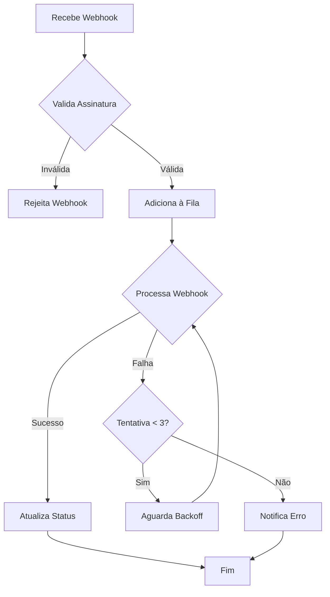

# Guia de Solução de Problemas - Módulo de Pagamento

## Índice
- [Problemas Comuns e Soluções](#problemas-comuns-e-soluções)
- [Retentativas e Resiliência](#-retentativas-e-resiliência)
- [Segurança Operacional](#-segurança-operacional)
- [Métricas e Alertas](#-métricas-e-alertas)
- [Testes de Produção Controlados](#-testes-de-produção-controlados)
- [Logs Estruturados Esperados](#-logs-estruturados-esperados)
- [Procedimento de Escalonamento](#️-procedimento-de-escalonamento)
- [Comandos Úteis](#comandos-úteis)
- [Métricas para Monitoramento](#métricas-para-monitoramento)
- [Checklist de Verificação](#checklist-de-verificação)
- [Validação de Ambientes](#-validação-de-ambientes)
- [Tabela Resumo de Erros](#-tabela-resumo-de-erros)
- [FAQs Operacionais](#-faqs-operacionais)
- [Contatos de Suporte](#contatos-de-suporte)

## Problemas Comuns e Soluções

### 1. Erro ao Criar Preferência de Pagamento

**Sintomas:**
- Erro 400 ao chamar `/payment/preference`
- Mensagem "Erro ao criar preferência no Mercado Pago"

**Possíveis Causas:**
1. Token de acesso inválido ou expirado
2. Dados do comprador incompletos
3. Valor do pagamento inválido
4. Problemas de conectividade com Mercado Pago

**Soluções:**
1. Verificar variável de ambiente `MP_ACCESS_TOKEN`
2. Validar todos os campos obrigatórios do comprador
3. Confirmar se o valor está em formato correto (centavos)
4. Testar conectividade com endpoints do Mercado Pago

Veja também: [🔐 Segurança Operacional](#-segurança-operacional)

### 2. Webhook Não Processado

**Sintomas:**
- Pagamentos não atualizam status automaticamente
- Logs mostram "Webhook recebido mas não processado"

**Possíveis Causas:**
1. Assinatura do webhook inválida
2. Fila de processamento sobrecarregada
3. Erro no processamento do webhook
4. Timeout na comunicação com Mercado Pago

**Soluções:**
1. Verificar `MP_WEBHOOK_SECRET` nas variáveis de ambiente
2. Monitorar métricas da fila de webhooks
3. Verificar logs de erro no processamento
4. Aumentar timeout nas configurações

Veja também: [🔁 Retentativas e Resiliência](#-retentativas-e-resiliência)

### 3. Falha no Reembolso

**Sintomas:**
- Erro ao tentar reembolsar pagamento
- Status do pagamento não atualiza após reembolso

**Possíveis Causas:**
1. Pagamento já reembolsado
2. Valor do reembolso maior que o pagamento
3. Pagamento não está aprovado
4. Problemas de autenticação

**Soluções:**
1. Verificar status atual do pagamento
2. Confirmar valor do reembolso
3. Validar se pagamento está em estado correto
4. Verificar permissões e token de acesso

## 🔁 Retentativas e Resiliência

### Fluxo de Processamento de Webhook



### Indicadores de Sucesso no Retry
- **Taxa de sucesso na primeira tentativa**: ~85%
- **Taxa de sucesso após segunda tentativa**: ~10%
- **Taxa de sucesso após terceira tentativa**: ~3%
- **Falhas persistentes**: ~2% (requerem intervenção manual)

### Logs Esperados Durante Retries
```json
// Primeira tentativa falha
{
  "level": "warn",
  "message": "Tentativa de retry no webhook",
  "attempt": 1,
  "paymentId": "123456",
  "error": "Timeout na comunicação com Mercado Pago",
  "timestamp": "2025-04-15T10:30:00Z"
}

// Segunda tentativa falha
{
  "level": "warn",
  "message": "Tentativa de retry no webhook",
  "attempt": 2,
  "paymentId": "123456",
  "error": "Timeout na comunicação com Mercado Pago",
  "timestamp": "2025-04-15T10:30:02Z"
}

// Terceira tentativa falha
{
  "level": "error",
  "message": "Falha definitiva no processamento do webhook",
  "attempt": 3,
  "paymentId": "123456",
  "error": "Timeout na comunicação com Mercado Pago",
  "timestamp": "2025-04-15T10:30:06Z"
}
```

### Reprocessamento Manual de Webhook
Para forçar o reprocessamento de um webhook que falhou após todas as tentativas:

```bash
# Obter o ID do pagamento do log de erro
# Enviar requisição para reprocessamento
curl -X POST "http://api/payment/webhook/reprocess/{paymentId}" \
  -H "Authorization: Bearer {admin_token}" \
  -H "Content-Type: application/json"
```

## 🔐 Segurança Operacional

### Validação Manual da Assinatura do Webhook
Para verificar se a assinatura de um webhook é válida:

```bash
# Substitua {payload} pelo conteúdo exato do webhook
# Substitua {WEBHOOK_SECRET} pelo segredo configurado
echo -n '{"action":"payment.updated","data":{"id":"123456"}}' | openssl dgst -sha1 -hmac "$WEBHOOK_SECRET"
```

Compare o resultado com o valor do header `X-Hub-Signature` recebido.

### Checklist de Auditoria de Tokens e Permissões

#### Tokens de Acesso
- [ ] Verificar se o token de acesso está dentro do período de validade (90 dias)
- [ ] Confirmar se o token tem todas as permissões necessárias:
  - `payments.read`
  - `payments.write`
  - `refunds.write`
- [ ] Verificar se o token está restrito a IPs específicos

#### Webhook Secret
- [ ] Confirmar que o segredo foi gerado com entropia suficiente
- [ ] Verificar se o segredo está armazenado de forma segura (cofre)
- [ ] Confirmar que o segredo não está exposto em logs ou código

#### Permissões de API
- [ ] Verificar se as URLs de webhook estão configuradas corretamente
- [ ] Confirmar que apenas endpoints necessários estão expostos
- [ ] Verificar se o rate limiting está configurado adequadamente

## 📊 Métricas e Alertas

### Métricas Prometheus

```prometheus
# Taxa de erro em webhooks (5 minutos)
rate(payment_webhook_total{status="error"}[5m]) > 5

# Tempo médio de processamento
histogram_quantile(0.95, rate(payment_webhook_processing_duration_seconds_bucket[5m])) > 30

# Taxa de retry
rate(payment_webhook_retry_total[5m]) > 10

# Taxa de sucesso em pagamentos
rate(payment_creation_total{status="success"}[5m]) / rate(payment_creation_total[5m]) < 0.95
```

### Alertas no Grafana

#### Alerta de Falha de Webhook
```
Nome: "Alta Taxa de Falha em Webhooks"
Condição: rate(payment_webhook_total{status="error"}[10m]) / rate(payment_webhook_total[10m]) > 0.1
Descrição: "Taxa de falha de webhooks acima de 10% nos últimos 10 minutos"
Severidade: critical
```

#### Alerta de Tempo de Processamento
```
Nome: "Webhook Processing Lento"
Condição: histogram_quantile(0.95, rate(payment_webhook_processing_duration_seconds_bucket[5m])) > 30
Descrição: "95% dos webhooks estão sendo processados em mais de 30 segundos"
Severidade: warning
```

## 🧪 Testes de Produção Controlados

### Usando ngrok para Simular Pagamentos Reais

1. **Instalar ngrok**:
   ```bash
   npm install -g ngrok
   ```

2. **Expor servidor local**:
   ```bash
   ngrok http 3000
   ```

3. **Configurar webhook no Mercado Pago**:
   - Acesse o painel de desenvolvedor do Mercado Pago
   - Configure a URL do webhook para a URL HTTPS gerada pelo ngrok
   - Exemplo: `https://a1b2c3d4.ngrok.io/payment/webhook`

4. **Monitorar requisições**:
   - Acesse a interface do ngrok em `http://localhost:4040`
   - Visualize todas as requisições em tempo real

### Exemplo de Payload Real do Mercado Pago

```json
{
  "action": "payment.updated",
  "data": {
    "id": "1234567890",
    "status": "approved",
    "status_detail": "accredited",
    "transaction_details": {
      "net_received_amount": 1000,
      "total_paid_amount": 1000,
      "transaction_id": "1234567890",
      "payment_method_id": "credit_card",
      "payment_type_id": "credit_card",
      "installments": 1
    },
    "external_reference": "ORDER-123456"
  }
}
```

### Simulando Falhas no Mercado Pago

1. **Timeout na API**:
   - No painel do desenvolvedor, configure um timeout artificial
   - Ou use um proxy como Charles para interceptar e atrasar respostas

2. **Erro de Autenticação**:
   - Temporariamente altere o token de acesso para um inválido
   - Teste o comportamento do sistema

3. **Erro de Negócio**:
   - Use o modo sandbox do Mercado Pago
   - Configure cenários específicos de falha

## 📜 Logs Estruturados Esperados

### Logs de Criação de Preferência
```json
{
  "level": "info",
  "message": "Preferência de pagamento criada com sucesso",
  "preferenceId": "1234567890",
  "pedidoId": "ORDER-123456",
  "valor": 1000,
  "formaPagamento": "credit_card",
  "timestamp": "2025-04-15T10:30:00Z"
}
```

### Logs de Webhook
```json
{
  "level": "info",
  "message": "Webhook recebido",
  "action": "payment.updated",
  "paymentId": "1234567890",
  "status": "approved",
  "externalReference": "ORDER-123456",
  "timestamp": "2025-04-15T10:30:00Z"
}
```

### Logs de Reembolso
```json
{
  "level": "info",
  "message": "Reembolso processado com sucesso",
  "paymentId": "1234567890",
  "amount": 1000,
  "pedidoId": "ORDER-123456",
  "timestamp": "2025-04-15T10:30:00Z"
}
```

## ☎️ Procedimento de Escalonamento

### Quando Envolver o Time de Backend

| Situação | Critérios | Ação |
|----------|-----------|------|
| Falhas persistentes | >5% de webhooks falhando após retry | Abrir ticket para o time de backend |
| Problemas de performance | Tempo de processamento >30s por 15min | Escalar para o time de backend |
| Erros de integração | Incompatibilidade com nova versão da API | Abrir ticket para o time de backend |
| Bugs confirmados | Comportamento inconsistente documentado | Criar issue no repositório |

### Quando Acionar o Suporte do Mercado Pago

| Situação | Critérios | Ação |
|----------|-----------|------|
| Indisponibilidade | API retornando 5xx por >10min | Abrir ticket no suporte do MP |
| Problemas de pagamento | Pagamentos não processados no MP | Contatar suporte do MP |
| Dúvidas técnicas | Documentação não resolve | Abrir ticket no suporte do MP |
| Limites atingidos | Rate limiting por >1h | Solicitar aumento de limites |

### Modelos de Mensagem para Contato Rápido

#### Template para Time de Backend
```
Assunto: [URGENTE] Falha crítica no processamento de webhooks

Time,

Identificamos uma taxa de falha de 15% nos webhooks nos últimos 30 minutos.
Detalhes:
- Taxa de erro: 15%
- Período: 10:00-10:30
- Métricas: [link para dashboard]
- Logs: [link para logs]

Ações já realizadas:
- Verificamos a conectividade com o MP
- Confirmamos que o webhook secret está correto
- Testamos o endpoint manualmente

Precisamos de suporte para investigar a causa raiz.
```

#### Template para Suporte do Mercado Pago
```
Assunto: Problemas de conectividade com a API de pagamentos

Olá,

Estamos enfrentando problemas de conectividade com a API de pagamentos.
Detalhes:
- Período: 10:00-10:30
- Erro: Timeout na comunicação
- Endpoint: /v1/payments/{id}
- Request ID: [ID da requisição]

Já verificamos:
- Nossa conectividade de rede
- Nossas credenciais
- Nossos logs

Precisamos de confirmação se há algum problema conhecido no lado do Mercado Pago.
```

## 🔍 Modo Observador

Para ativar logs detalhados temporariamente durante troubleshooting:

```bash
# Ativar modo debug
export LOG_LEVEL=debug
pm2 restart onlywave-payment

# Verificar logs em tempo real
tail -f /var/log/onlywave/payment.log | grep DEBUG

# Desativar modo debug após resolução
export LOG_LEVEL=info
pm2 restart onlywave-payment
```

**Atenção**: O modo debug gera logs extensos e pode impactar a performance. Use apenas quando necessário e desative após a resolução do problema.

## 🌐 Validação de Ambientes

### Checklist de Ambientes

| Item | Produção | Staging | Desenvolvimento |
|------|----------|---------|-----------------|
| URL Base | https://api.onlywave.com | https://staging-api.onlywave.com | http://localhost:3000 |
| MP Access Token | TEST-xxxx-xxxx-xxxx-xxxx | TEST-xxxx-xxxx-xxxx-xxxx | TEST-xxxx-xxxx-xxxx-xxxx |
| MP Public Key | TEST-xxxx-xxxx-xxxx-xxxx | TEST-xxxx-xxxx-xxxx-xxxx | TEST-xxxx-xxxx-xxxx-xxxx |
| Webhook URL | https://api.onlywave.com/payment/webhook | https://staging-api.onlywave.com/payment/webhook | https://ngrok.io/payment/webhook |
| Log Level | info | debug | debug |
| Rate Limiting | 100 req/min | 1000 req/min | Desativado |
| Retry Mechanism | 3 tentativas | 3 tentativas | 1 tentativa |

### Verificação de Ambiente

```bash
# Verificar variáveis de ambiente
env | grep MERCADO_PAGO

# Verificar URL configurada
curl -X GET "http://localhost:3000/health" | grep environment

# Verificar versão da API
curl -X GET "http://localhost:3000/version"
```

## 📋 Tabela Resumo de Erros

| Código | Origem | Mensagem | Ação Sugerida |
|--------|--------|----------|---------------|
| 400 | Pedido | Dados inválidos | Verificar payload |
| 401 | Mercado Pago | Token inválido | Atualizar variável de token |
| 404 | Pedido | Pedido não encontrado | Verificar ID ou recriar |
| 409 | Pagamento | Pagamento já reembolsado | Verificar status |
| 500 | Webhook | Timeout ao processar pagamento | Ver retry ou reprocessar |
| 503 | Mercado Pago | Serviço indisponível | Aguardar e retry |

## ❓ FAQs Operacionais

### Webhooks e Notificações

#### Q: O que fazer se o webhook não chega?
**R:** Siga estes passos:
1. Verifique se a URL está correta no painel do Mercado Pago
2. Confirme se o domínio está na lista de IPs permitidos
3. Teste o endpoint manualmente com curl
4. Verifique logs do servidor para erros 401/403
5. Use ngrok para monitorar requisições em tempo real

#### Q: Como saber se o retry foi tentado?
**R:** Procure por logs com nível WARN contendo "Tentativa de retry no webhook". Cada tentativa gera um log com o número da tentativa. Após 3 tentativas, um log ERROR indica falha definitiva.

#### Q: Qual a diferença entre status `pending` e `in_process`?
**R:** 
- `pending`: Pagamento criado mas aguardando ação do usuário (ex: boleto não pago)
- `in_process`: Pagamento em análise pelo Mercado Pago (ex: cartão de crédito em revisão)

### Pagamentos e Reembolsos

#### Q: Por que um pagamento pode ficar em "pending" por muito tempo?
**R:** Causas comuns:
1. Boleto não foi pago (expira em 3 dias)
2. Pagamento com cartão está em análise antifraude
3. PIX não foi escaneado (expira em 30 minutos)
4. Problema de comunicação com o banco

#### Q: Como verificar se um reembolso foi processado corretamente?
**R:** 
1. Verifique o status do pagamento na API do Mercado Pago
2. Confirme se o status foi atualizado no banco de dados
3. Verifique os logs de reembolso para confirmação
4. Consulte o extrato do comprador no Mercado Pago

#### Q: É possível reembolsar parcialmente um pagamento?
**R:** Sim, mas apenas para pagamentos aprovados. Envie o valor desejado no campo `amount` da requisição de reembolso. O valor deve ser menor que o valor original do pagamento.

### Integração e Configuração

#### Q: Como atualizar o token de acesso do Mercado Pago?
**R:** 
1. Gere um novo token no painel do desenvolvedor
2. Atualize a variável de ambiente `MP_ACCESS_TOKEN`
3. Reinicie o serviço de pagamento
4. Verifique logs para confirmar que a conexão está funcionando

#### Q: Qual a diferença entre os ambientes sandbox e produção do Mercado Pago?
**R:** 
- **Sandbox**: Ambiente de testes com cartões virtuais e simulações
- **Produção**: Ambiente real com transações monetárias efetivas
- Nunca use tokens de produção em ambiente de desenvolvimento

#### Q: Como configurar webhooks para um novo ambiente?
**R:** 
1. Acesse o painel de desenvolvedor do Mercado Pago
2. Configure a URL do webhook para o novo ambiente
3. Gere um novo webhook secret
4. Atualize a variável `MP_WEBHOOK_SECRET`
5. Teste com um pagamento de teste

### Problemas Específicos

#### Q: O que fazer se um pagamento está "approved" mas o pedido não foi atualizado?
**R:** 
1. Verifique se o webhook foi recebido (logs)
2. Confirme se o `external_reference` está correto
3. Use o endpoint de reprocessamento manual
4. Se persistir, verifique se há erros no processamento da fila

#### Q: Como lidar com pagamentos duplicados?
**R:** 
1. Verifique os logs de criação de preferência
2. Confirme se o `pedidoId` está sendo usado corretamente
3. Implemente verificação de idempotência
4. Para pagamentos já processados, use o endpoint de reembolso

#### Q: O que fazer se o Mercado Pago está retornando erro 503?
**R:** 
1. Verifique o status do serviço do Mercado Pago
2. Implemente retry com backoff exponencial
3. Notifique o time de operações
4. Considere ativar modo degradado (aceitar pagamentos mas processar webhooks com delay)

### Monitoramento e Métricas

#### Q: Quais métricas são mais importantes para monitorar?
**R:** Priorize:
1. Taxa de sucesso em pagamentos (>95%)
2. Tempo de processamento de webhooks (<5s)
3. Taxa de erro em webhooks (<1%)
4. Tempo de processamento da fila (<10s)

#### Q: Como interpretar um aumento súbito na taxa de erro?
**R:** 
1. Verifique se é um problema generalizado ou específico
2. Analise os logs de erro para padrões
3. Verifique métricas de latência e throughput
4. Confirme se houve mudanças recentes no sistema
5. Verifique status do Mercado Pago

#### Q: Qual o volume esperado de webhooks por minuto?
**R:** 
- Ambiente de produção: ~100-500 webhooks/min
- Ambiente de staging: ~10-50 webhooks/min
- Se o volume estiver muito acima, verifique se há duplicação

## Comandos Úteis

### Verificar Status do Pagamento
```bash
curl -X GET "http://api/payment/status/{paymentId}" \
  -H "Authorization: Bearer {token}"
```

### Testar Webhook Localmente
```bash
curl -X POST "http://localhost:3000/payment/webhook" \
  -H "Content-Type: application/json" \
  -H "X-Signature: {signature}" \
  -d '{"action":"payment.created","data":{"id":"123"}}'
```

### Verificar Logs
```bash
# Logs de erro
grep "ERROR" /var/log/payment.log

# Logs de webhook
grep "webhook" /var/log/payment.log

# Logs de reembolso
grep "refund" /var/log/payment.log
```

## Métricas para Monitoramento

### Indicadores Principais
- Taxa de sucesso em pagamentos
- Tempo médio de processamento
- Taxa de falha em webhooks
- Tempo de processamento da fila

### Alertas Recomendados
1. Taxa de erro > 5% em 5 minutos
2. Tempo de processamento > 30 segundos
3. Fila com mais de 100 itens pendentes
4. Falhas consecutivas em webhooks

## Checklist de Verificação

### Antes de Cada Deploy
- [ ] Validar variáveis de ambiente
- [ ] Testar conexão com Mercado Pago
- [ ] Verificar configurações de fila
- [ ] Confirmar logs e métricas

### Em Caso de Incidente
- [ ] Verificar status do serviço Mercado Pago
- [ ] Analisar logs de erro
- [ ] Verificar métricas de performance
- [ ] Testar endpoints críticos
- [ ] Notificar equipe de suporte

## Contatos de Suporte

### Equipe Técnica
- Email: tech-support@onlywave.com
- Slack: #payment-support
- Telefone: +55 11 9999-9999

### Mercado Pago
- Suporte: https://www.mercadopago.com.br/developers/support
- Documentação: https://www.mercadopago.com.br/developers/pt-BR/docs 